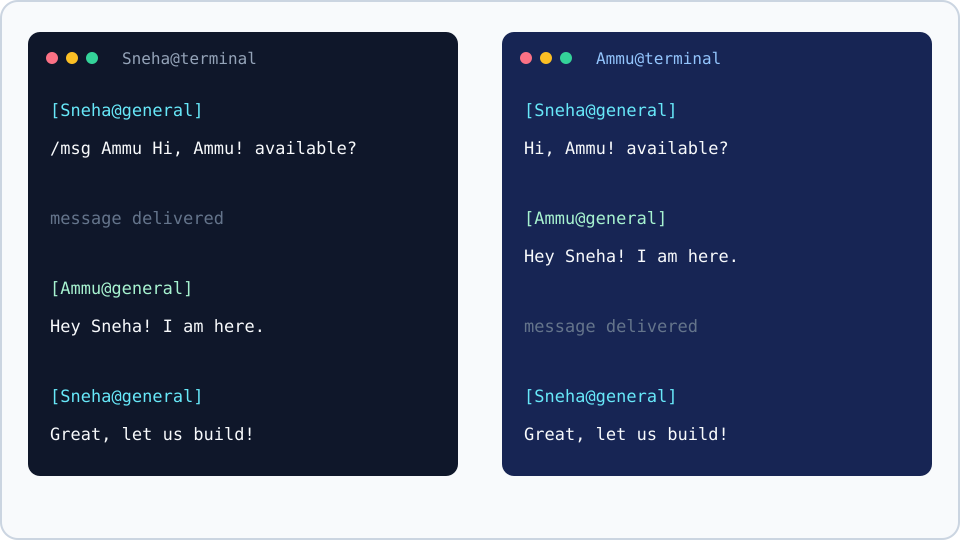
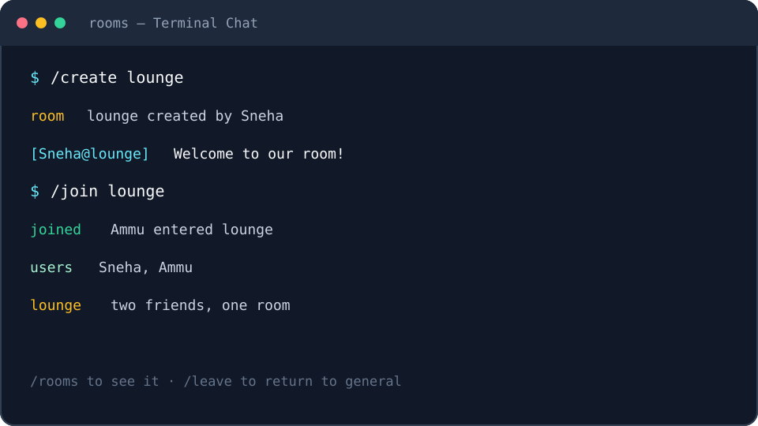
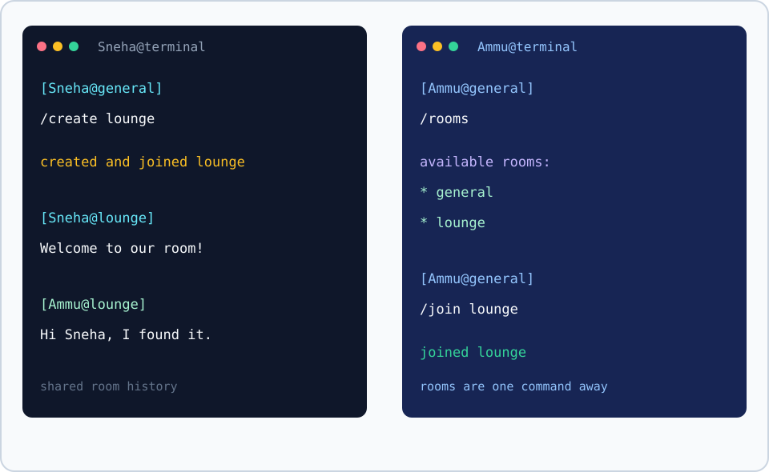

# Terminal Chat Application

<p align="center">
	<strong>Terminal Chat</strong><br>
	<em>A tiny room for learning Go, one message at a time.</em>
</p>

<p align="center">
	
</p>

This is a fun starter project for me to understand Go by building something I would actually use: a multiplayer terminal chat application. It uses raw TCP and newline-delimited JSON to explore goroutines, channels, synchronized shared state, rooms, private messages, and persistent history.

## Showcase

The room story: Sneha creates `lounge`, Ammu finds it with `/rooms`, and joins with `/join lounge`.

<p align="center">
	
</p>

<p align="center">
	
</p>

> **The idea:** open one terminal for the server, two or more for friends, and let the command line become the chat room.

## Prerequisites

- Go 1.27 or newer

## Run

### 1. Start the server

Open a terminal and run:

```powershell
go run ./cmd/server -addr localhost:8080
# Optional custom history file:
go run ./cmd/server -addr localhost:8080 -data data/messages.jsonl
```

### 2. Join with two clients

Open two more terminals and run this in each one:

```powershell
go run ./cmd/client -addr localhost:8080
```

Choose a different username in each terminal, then try a tiny conversation:

```text
[alice@general] Hello Bob!
[bob@general] Hi Alice!
[alice@general] /create lounge
[alice@lounge] This room is ours now.
[bob@general] /msg alice Meet me in lounge!
```

Each client asks for a unique username and starts in `general`. Type normal text and press Enter to broadcast it to members of the current room. Enter `/quit` to disconnect. Press `Ctrl+C` in the server terminal for graceful shutdown.

Room commands:

```text
/rooms          List available rooms
/create lounge  Create and join a room
/join lounge    Join an existing room
/leave          Return to general
/users          List online users and their rooms
/msg bob Hi!    Send a private message
/history        Show recent history for the current room
/history 50     Show up to 50 recent messages
/help           Show command usage
/quit           Disconnect
```

Example:

```text
[alice@general] Hello Bob!
[bob@general] Hi Alice!
```

## Architecture

- `internal/protocol` contains the shared JSON message types and constants.
- `internal/server` accepts TCP connections, tracks unique users and rooms, and uses one writer goroutine and buffered outgoing channel per client.
- `internal/client` reads terminal input while a separate goroutine receives server messages.
- `cmd/server` and `cmd/client` provide the command-line entry points.

Messages are newline-delimited JSON. A client registers with `{"type":"register","username":"alice"}`, joins with `{"type":"join_room","content":"lounge"}`, sends chat with `{"type":"chat","content":"Hello"}`, requests history with `{"type":"history","limit":20}`, and sends private messages with `{"type":"private_message","target":"bob","content":"Hi"}`. The server broadcasts chat only to members of the sender's current room and sends private messages only to the sender and recipient.

## Message persistence

The server stores room chat messages as one JSON object per line in `data/messages.jsonl` by default. Each record contains a UTC timestamp, username, room, and message content. The storage interface is isolated in `internal/store`, so the JSON Lines backend can be replaced later.

## Current scope

Phase 5 includes private messages, online-user listing, complete command parsing, JSON Lines message persistence, room history, integration tests, Makefile targets, and graceful server shutdown.

## Architecture details

- `cmd/server` parses configuration, opens the persistent store, and handles OS shutdown signals.
- `cmd/client` starts the interactive terminal client.
- `internal/server` owns TCP listeners, client connections, rooms, username uniqueness, routing, and graceful shutdown.
- `internal/client` translates terminal commands and renders server events from a reader goroutine.
- `internal/protocol` defines the shared newline-delimited JSON message contract.
- `internal/store` contains the replaceable `MessageStore` interface, memory implementation, and JSON Lines implementation.
- `pkg/models` contains persisted domain models.

Each connected client has a buffered outgoing channel and dedicated writer goroutine. The server protects clients, rooms, and membership with `sync.RWMutex`. The storage implementations protect their data with their own mutexes.

## Protocol

Messages are one JSON object per line. Examples:

```json
{"type":"register","username":"alice"}
{"type":"join_room","content":"lounge"}
{"type":"chat","content":"Hello"}
{"type":"private_message","target":"bob","content":"Hi"}
{"type":"history","limit":20}
```

Server events use `system`, `error`, `chat`, `private_message`, and `history` message types. Chat events include the sender and room. The protocol definitions are shared by both client and server.

## Persistence

Room chat messages are stored as JSON Lines in `data/messages.jsonl`. Each record contains a UTC timestamp, username, room, and content. `/history` reads only the current room and defaults to the most recent 20 records, with a maximum of 100 per request.

## Development

```powershell
make test
make test-race
make vet
make build
make clean
```

The equivalent Go commands are `go test ./...`, `go test -race ./...`, `go vet ./...`, and `go build ./cmd/server` / `go build ./cmd/client`.

## Project structure

```text
cmd/
	client/main.go
	server/main.go
internal/
	chat/
	client/
	protocol/
	server/
	store/
pkg/models/
data/
Makefile
```

## Future improvements

- Add authentication and authorization for room administration.
- Add message IDs, delivery acknowledgements, and paginated history.
- Add configurable retention and stronger persistence recovery.
- Add richer terminal rendering and input handling.
- Add CI coverage across Windows, macOS, and Linux.
